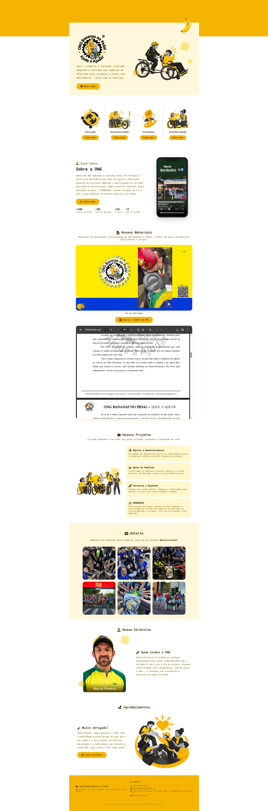

# Projeto finalizado — 18/09/2026

Quero agradecer à ONG pela oportunidade de poder contribuir mais uma vez.

Este projeto utiliza um layout que já foi implementado em outros projetos. Pensando melhor, percebi que muitas soluções de sites acabam seguindo estruturas semelhantes. É justamente por isso que existem frameworks, com componentes prontos e reutilizáveis.

No meu caso, quando o cliente escolhe um layout que já foi implementado, consigo reduzir o tempo de desenvolvimento, enquanto o cliente ganha em velocidade de entrega. A partir do layout escolhido, geralmente preciso apenas gerar ou adaptar as imagens utilizando uma LLM. Em casos mais específicos, também realizo algumas modificações diretamente no código.

Dessa forma, consigo reaproveitar uma estrutura já testada, mantendo a possibilidade de personalizar o projeto de acordo com as necessidades de cada ONG.

  

# Licença — Todos os Direitos Reservados

Copyright © 2026. Todos os direitos reservados.

Este repositório é disponibilizado exclusivamente para fins de visualização e consulta.

É permitido:

* Visualizar o conteúdo deste repositório.
* Consultar a estrutura e a organização do projeto.

Não é permitido, sem autorização prévia e expressa do autor:

* Copiar o código-fonte ou qualquer parte deste projeto.
* Modificar, adaptar ou criar trabalhos derivados.
* Redistribuir ou republicar o código.
* Utilizar o código, total ou parcialmente, em outros projetos.
* Utilizar o projeto para fins comerciais ou não comerciais.
* Reivindicar autoria sobre qualquer parte deste projeto.

A visualização pública deste repositório não constitui concessão de licença, autorização de uso, direitos autorais ou quaisquer outros direitos sobre o conteúdo.

Qualquer utilização além da simples visualização e consulta requer autorização prévia do detentor dos direitos autorais.

**Uso não autorizado não é permitido.**
